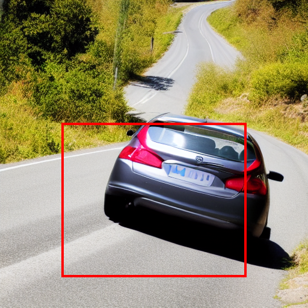

# Diffusers based Training-Free Layout Control with Cross-Attention Guidance

This repository provides an implementation of the paper [Training-Free Layout Control with Cross-Attention Guidance](https://arxiv.org/abs/2304.03373) using 🤗 [Hugging Face](https://github.com/huggingface/diffusers) Diffusion models. The code is adaptation of the original implementation by silen-chen is also acknowledged and extended here to make it more accessible. Special thanks to [@silen-chen](https://github.com/silent-chen) for sharing their work. Additionally, we use the work in AttendExcite diffusers as reference.

Currently, it only supports backward guidance. The forward guidance will be added soon.

## Installation

```shell
pip install git+https://github.com/nipunjindal/diffusers-layout-guidance.git
```

## How to use Training-Free Layout Control Guidance (TFLCG)

```python
from tflcg.layout_guidance_pipeline import LayoutGuidanceStableDiffusionPipeline
from diffusers import EulerDiscreteScheduler

pipe = LayoutGuidanceStableDiffusionPipeline.from_pretrained("runwayml/stable-diffusion-v1-5")
pipe = pipe.to("mps")
pipe.scheduler = EulerDiscreteScheduler.from_config(pipe.scheduler.config)

prompt = "A cat playing with a ball"
bboxes = [[0.55, 0.4, 0.95, 0.8]]
image = pipe(prompt, num_inference_steps=20,
             token_indices=[[2]],
             bboxes=bboxes).images[0]
image = pipe.draw_box(image, bboxes)
display(image)
```

## Image Examples
To use the repository, follow the steps below to enable the outputs:

1. Install the required dependencies (instructions are provided in the README).
2. Use the provided code snippets to generate images with the desired settings. You can play around with the various parameters such as `max_guidance_iter`, `max_guidance_iter_per_step`, and `scale_factor` to adjust the output according to your needs.
3. Keep in mind that increasing the `scale_factor` may result in a loss of fidelity in the generated images.

Feel free to experiment with the various settings and see how they affect the output. If you have any questions or run into any issues, please refer to the documentation or reach out to the community for help.

Below are some examples of the types of images you can generate using our models:

## Cat Playing with a Ball


## Person Holding an Umbrella in the Rain


## Car Driving on a Winding Road


## Child Blowing Bubbles


## Person Surfing on a Wave


## Contributing and Issues
Please feel free to contribute to this repository by submitting pull requests or creating issues in the [GitHub repository](https://github.com/nipunjindal/diffusers-layout-guidance). If you encounter any bugs or have suggestions for improvements, don't hesitate to open an issue. We welcome all contributions and appreciate your feedback!

## Citation

```bibtex
@article{chen2023trainingfree,
      title={Training-Free Layout Control with Cross-Attention Guidance}, 
      author={Minghao Chen and Iro Laina and Andrea Vedaldi},
      journal={arXiv preprint arXiv:2304.03373},
      year={2023}
}
```